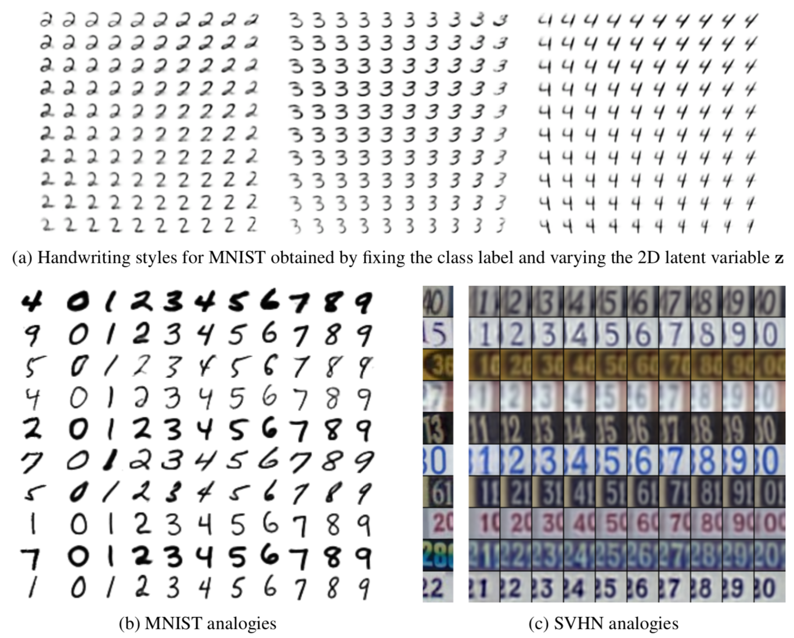

# Semi-supervised PyTorch

A PyTorch-based package containing useful models for modern deep semi-supervised learning and deep generative models. Want to jump right into it? Look into the [notebooks](examples/notebooks).

### Latest additions

*2018.04.17* - The Gumbel softmax notebook has been added to show how
you can use discrete latent variables in VAEs.
*2018.02.28* - The β-VAE notebook was added to show how VAEs can learn disentangled representations.

## What is semi-supervised learning?

Semi-supervised learning tries to bridge the gap between supervised and unsupervised learning by learning from both
labelled and unlabelled data.

Semi-supervised learning can typically be applied to areas where data is easy to get a hold of, but labelling is expensive.
Normally, one would either use an unsupervised method, or just the few labelled examples - both of which would be
likely to yield bad results.

The current state-of-the-art method in semi-supervised learning achieves an accuracy of over 99% on the MNIST dataset using just **10 labelled examples per class**.

## Conditional generation

Most semi-supervised models simultaneously train an inference network and a generator network. This means that it is
not only possible to query this models for classification, but also to generate new data from trained model.
By seperating label information, one can generate a new sample with the given digit as shown in the image below from
Kingma 2014.

## Implemented models and methods:

* [Variational Autoencoder (Kingma 2013)](https://arxiv.org/abs/1312.6114)
* [Importance Weighted Autoencoders (Burda 2015)](https://arxiv.org/abs/1509.00519)
* [Variational Inference with Normalizing Flows (Rezende & Mohamed 2015)](https://arxiv.org/abs/1505.05770)
* [Semi-supervised Learning with Deep Generative Models (Kingma 2014)](https://arxiv.org/abs/1406.5298)
* [Auxiliary Deep Generative Models (Maaløe 2016)](https://arxiv.org/abs/1602.05473)
* [Ladder Variational Autoencoders (Sønderby 2016)](https://arxiv.org/abs/1602.02282)
* [β-VAE (Higgins 2017)](https://openreview.net/forum?id=Sy2fzU9gl)
